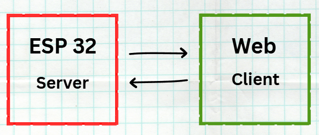
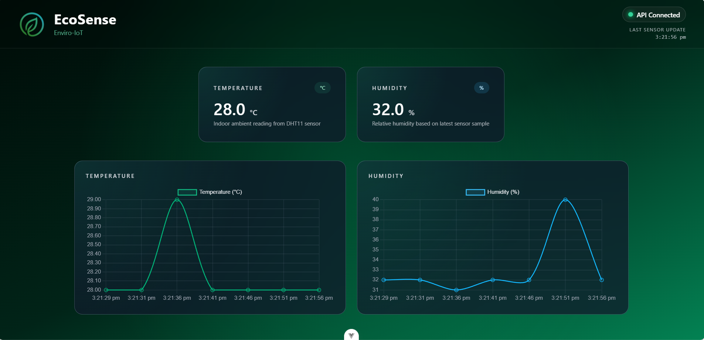

# 🌿 EcoSense – Enviro-IoT Dashboard  
*A modern environmental monitoring system powered by ESP32 + Vue 3*

EcoSense is a premium, real-time **IoT dashboard** that displays **temperature** and **humidity** readings collected from a **DHT11 sensor**, processed by an **ESP32 microcontroller**, and visualized through a **modern glass-style web interface** built with **Vue 3 + TailwindCSS**.

This project demonstrates:
- Embedded development (ESP32 firmware)
- REST API communication
- Real-time data visualization
- Beautiful modern UI/UX dashboard design

---

## 📡 System Architecture

EcoSense uses a **client–server architecture** where the ESP32 provides sensor data and the Vue dashboard consumes and visualizes it.

### Communication Flow  


**ESP32 REST API Endpoints**

| Endpoint | Description | Example Output |
|---------|-------------|----------------|
| `/hello` | Basic connectivity test | `"Hello World from ESP32!"` |
| `/data` | Sensor data (JSON) | `{ "temperature": 28.0, "humidity": 32.0 }` |

---

## 🌈 Web Dashboard UI (Preview)

EcoSense features a **clean**, **modern**, glass-style IoT dashboard with smooth gradients and real-time charts.



### Dashboard Features
- Live **temperature** display (°C)  
- Live **humidity** display (%)  
- Real-time line charts with auto-updating  
- API connection indicator (Connected / Disconnected)  
- Timestamp of last sensor update  
- Modern glass-UI with gradients and soft shadows  
- Fully responsive (desktop → mobile)

---

## ⚙️ Tech Stack

### **Embedded / Hardware**
- ESP32 (WiFi Station Mode)
- DHT11 sensor
- ESP-IDF (recommended) or Arduino framework

### **Frontend**
- Vue 3 (Composition API)
- TailwindCSS
- Chart.js
- Vite Dev Server

### **Communication**
- REST API over HTTP  
- JSON responses  
- Local WiFi network  

---

## 📁 Project Structure

```
EcoSense/
│
├── diagram/
│   ├── esp_web.png
│   ├── eco_sense_ui.png
│
├── esp32/
│   ├── main.c
│   ├── dht_driver/
│   └── ...
│
├── web/
│   ├── src/
│   ├── components/
│   ├── ChartsPanel.vue
│   ├── App.vue
│   └── ...
│
└── README.md
```

---

## 🚀 Getting Started

### **1️⃣ Flash the ESP32 Firmware**

1. Install **ESP-IDF**
2. Configure WiFi credentials:  
   ```
   idf.py menuconfig
   ```
3. Build & flash the firmware:  
   ```
   idf.py build
   idf.py -p COM3 flash monitor
   ```
4. ESP32 will show its IP address (example):  
   ```
   192.168.1.32
   ```

---

### **2️⃣ Start the Web Dashboard**

1. Go to the frontend folder:  
   ```
   cd web
   ```
2. Install dependencies:  
   ```
   npm install
   ```
3. Start development server:  
   ```
   npm run dev
   ```
4. Open in browser:  
   ```
   http://localhost:5173
   ```

---

### **3️⃣ Configure ESP32 IP Address**

In your Vue component (e.g., `ChartsPanel.vue`):

```js
const API_URL = "http://192.168.1.32/data";
```

Replace with the IP shown in the ESP32 logs.

---

## 🔧 ESP32 JSON Response Format

```json
{
  "temperature": 28.0,
  "humidity": 32.0
}
```

This JSON is fetched by the dashboard periodically to update UI and charts.

---

## 📊 Real-time Charts

Powered by **Chart.js**, the dashboard provides:

- Smooth animated line charts  
- Automatic pushing of new data  
- Removal of old entries  
- Temperature and humidity graphs  
- Responsive layout on all screen sizes  

---

## 🧪 Testing the API

Test endpoints directly:

```
http://<ESP32-IP>/hello
http://<ESP32-IP>/data
```

Example outputs:

```
Hello World from ESP32!
```

```json
{ "temperature": 28.0, "humidity": 32.0 }
```

---

## 🌱 Future Enhancements

- WebSocket live-data streaming  
- MQTT broker integration  
- Support for more sensors (CO₂, VOC, PM2.5, AQI)  
- Cloud dashboard (Firebase / Supabase)  
- Mobile app version  
- Admin panel for configurable update intervals  

---

## 🔖 License
MIT License — free to use, modify, and distribute.

---

## 👤 Author  
**Shakir Salam**  
Frontend Developer • IoT Enthusiast  
Malaysia 🇲🇾
